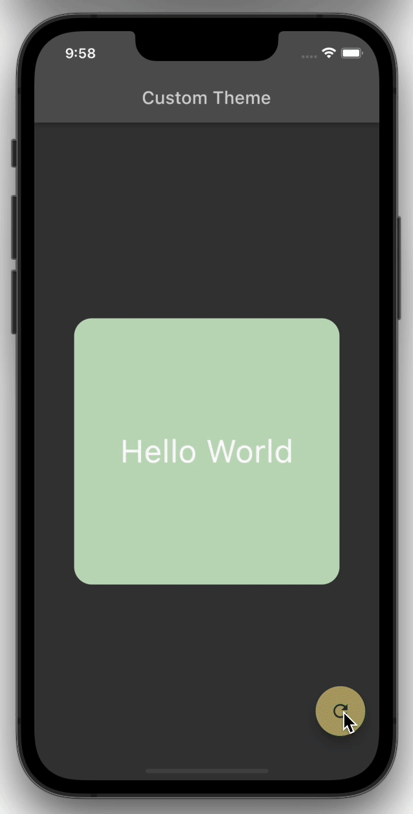

# Theming in Flutter

## #1 `ColorScheme`

|      |                    |                                                              |
| ---- | ------------------ | ------------------------------------------------------------ |
| 1    | `primary`          | The color displayed most frequently across your app’s screens and components. |
| 2    | `  primaryVariant` | A darker version of the primary color.                       |
| 3    | `secondary`        | An accent color that, when used sparingly, calls attention to parts of the app |
| 4    | `secondaryVariant` | A darker version of the secondary color.                     |
| 5    | `surface`          | The background color for widgets like `Card`                 |
| 6    | `background`       | A color that typically appears behind scrollable content.    |
| 7    | `error`            | The color to use for input validation errors, e.g. for `InputDecoration.errorText` |
| 8    | `onPrimary`        | A color that's clearly legible when drawn on ***Primary***   |
| 9    | `onSecondary`      |                                                              |
| 10   | `onSurface`        |                                                              |
| 11   | `onBackground`     |                                                              |
| 12   | `onError`          |                                                              |
| 13   | `brightness`       | The overall brightness of this color scheme.                 |

## #2 Out of the Box Color Schemes

Each of these built-in color schemes apply different colors to these 13 properties.

- `ColorScheme.light`
- `ColorScheme.dark`
- `ColorScheme.highContrastLight`
- `ColorScheme.highContrastDark`

### How to use these Color Schemes

By supplying a Color scheme to the `ThemeData.from()` factory constructor, entire app's theme can be configured.

```dart
return MaterialApp(
  debugShowCheckedModeBanner: false,
  theme: ThemeData.from(colorScheme: ColorScheme.highContrastLight()),
  home: Scaffold(
    appBar: AppBar(
      title: Text('Flutter Demo'),
    ),
    body: Center(child: Home()),
  ),
);
```

***A Color Scheme can also be created using the Primary Swatch color.***

```dart
return MaterialApp(
  debugShowCheckedModeBanner: false,
  theme: ThemeData.from(colorScheme: ColorScheme.fromSwatch(primarySwatch: Colors.amber)),
  home: Scaffold(
    appBar: AppBar(
      title: Text('Flutter Demo'),
    ),
    body: Center(child: Home()),
  ),
);
```

- The remaining properties of the `ColorScheme` are set in the `ColorScheme.fromSwatch` constructor.

## #3 Changing only the required colors - Using `copyWith`

*Example taken from Flutter source `theme_data.dart`* 

```dart
class MyApp extends StatelessWidget {
  @override
  Widget build(BuildContext context) {
    return MaterialApp(
      theme: ThemeData(
        colorScheme: ColorScheme.fromSwatch(
          primarySwatch: Colors.blue,
        ).copyWith(
          secondary: Colors.green,
        ),
        textTheme: const TextTheme(
          bodyText2: TextStyle(color: Colors.purple),
        ),
      ),
      home: Scaffold(
        appBar: AppBar(
          title: const Text('ThemeData Demo'),
        ),
        floatingActionButton: FloatingActionButton(
          child: const Icon(Icons.add),
          onPressed: () {},
        ),
        body: const Center(
          child: Text('Button pressed 0 times'),
        ),
      ),
    );
  }
}
```

- The Color scheme is based on `Colors.blue`
- The Color scheme's secondary color is overridden with `Colors.green`
- The Body Text 2 Color is changed to `Colors.purple`

****

## #4 How to create Custom themes

***The theming example here is taken from [Flokk](https://github.com/gskinnerTeam/flokk/blob/master/flokk_src/lib/themes.dart)***. I just changed the state implementation from *Provider* to *Riverpod.*

##### `custom_theme.dart`

```dart
import 'package:flutter/material.dart';

enum ThemeType {
  FlockGreen,
  FlockGreen_Dark,
}

class AppTheme {
  static const ThemeType defaultTheme = ThemeType.FlockGreen;

  AppTheme({
    required this.isDark,
    required this.bg1,
    required this.surface,
    required this.bg2,
    required this.accent1,
    required this.accent1Dark,
    required this.accent1Darker,
    required this.accent2,
    required this.accent3,
    required this.grey,
    required this.greyStrong,
    required this.greyWeak,
    required this.error,
    required this.focus,
    required this.txt,
    required this.accentTxt,
  });

  bool isDark;
  Color bg1;
  Color surface;
  Color bg2;
  Color accent1;
  Color accent1Dark;
  Color accent1Darker;
  Color accent2;
  Color accent3;
  Color grey;
  Color greyStrong;
  Color greyWeak;
  Color error;
  Color focus;
  Color txt;
  Color accentTxt;

  factory AppTheme.fromType(ThemeType t) {
    switch (t) {
      case ThemeType.FlockGreen:
        return AppTheme(
          isDark: false,
          txt: Colors.black,
          accentTxt: Colors.white,
          bg1: const Color(0xfff1f7f0),
          bg2: const Color(0xffc1dcbc),
          surface: Colors.white,
          accent1: const Color(0xff00a086),
          accent1Dark: const Color(0xff00856f),
          accent1Darker: const Color(0xff006b5a),
          accent2: const Color(0xfff09433),
          accent3: const Color(0xff5bc91a),
          greyWeak: const Color(0xff909f9c),
          grey: const Color(0xff515d5a),
          greyStrong: const Color(0xff151918),
          error: Colors.red.shade900,
          focus: const Color(0xFF0ee2b1),
        );

      case ThemeType.FlockGreen_Dark:
        return AppTheme(
          isDark: true,
          txt: Colors.white,
          accentTxt: Colors.black,
          bg1: const Color(0xff121212),
          bg2: const Color(0xff2c2c2c),
          surface: const Color(0xff252525),
          accent1: const Color(0xff00a086),
          accent1Dark: const Color(0xff00caa5),
          accent1Darker: const Color(0xff00caa5),
          accent2: const Color(0xfff19e46),
          accent3: const Color(0xff5BC91A),
          greyWeak: const Color(0xffa8b3b0),
          grey: const Color(0xffced4d3),
          greyStrong: const Color(0xffffffff),
          error: const Color(0xffe55642),
          focus: const Color(0xff0ee2b1),
        );
    }
  }

  ThemeData get themeData {
    var t = ThemeData.from(
      textTheme: (isDark ? ThemeData.dark() : ThemeData.light()).textTheme,
      colorScheme: ColorScheme(
        brightness: isDark ? Brightness.dark : Brightness.light,
        primary: accent1,
        primaryVariant: accent1Darker,
        secondary: accent2,
        secondaryVariant: accent2.withOpacity(0.5),
        background: bg1,
        surface: surface,
        onBackground: txt,
        onSurface: txt,
        onError: txt,
        onPrimary: accentTxt,
        onSecondary: accentTxt,
        error: error,
      ),
    );

    // We can also add on some extra properties that ColorScheme seems to miss
    return t.copyWith(
      inputDecorationTheme: const InputDecorationTheme(),
      materialTapTargetSize: MaterialTapTargetSize.shrinkWrap,
      highlightColor: accent1,
      toggleableActiveColor: accent1,
      textSelectionTheme: TextSelectionThemeData(
        selectionColor: greyWeak,
        selectionHandleColor: Colors.transparent,
        cursorColor: accent1,
      ),
    );
  }
}
```

- The `enum` defines two themes - Light & Dark.
- The `AppTheme` class defines properties to hold a variety of colors. It also has a factory constructor `AppTheme.fromType()` .
- To use Custom theme, we need a `ThemeData` object which will be passed to `MaterialApp()`.  So, the `AppTheme` class also has a getter `themeData` that creates a `ThemeData` object by configuring `textTheme` and `colorScheme`. Few other properties of `ThemeData` are also changed by using `copyWith()`.
- The `ColorScheme` class requires 13 properties to be passed. This is where  the colors from `AppTheme` are used.

##### `main.dart`

```dart
import 'package:custom_theme/custom_theme.dart';
import 'package:flutter/material.dart';
import 'package:flutter_riverpod/flutter_riverpod.dart';

class ApplicationTheme extends StateNotifier<AppTheme> {
  ApplicationTheme({themeType = ThemeType.FlockGreen})
      : _themeType = themeType,
        _theme = AppTheme.fromType(themeType),
        super(
          AppTheme.fromType(AppTheme.defaultTheme),
        );

  ThemeType _themeType;
  AppTheme _theme;

  AppTheme get theme => _theme;

  /// Switch between Light & Dark themes
  void changeTheme() {
    _themeType = _themeType == ThemeType.FlockGreen
        ? ThemeType.FlockGreen_Dark
        : ThemeType.FlockGreen;

    _theme = AppTheme.fromType(_themeType);

    state = _theme;
  }
}

final themeProvider = StateNotifierProvider<ApplicationTheme, AppTheme>(
    (ref) => ApplicationTheme());

void main() {
  runApp(
    const ProviderScope(
      child: MyApp(),
    ),
  );
}

class MyApp extends StatelessWidget {
  const MyApp({Key? key}) : super(key: key);

  @override
  Widget build(BuildContext context) {
    return Consumer(
      builder: (context, ref, _) {
        final AppTheme appTheme = ref.watch(themeProvider);

        // Build a ThemeData object using the current theme
        final ThemeData theme = appTheme.themeData;

        return MaterialApp(
          debugShowCheckedModeBanner: false,
          theme: theme,
          home: Scaffold(
            appBar: AppBar(
              title: const Text('Custom Theme'),
            ),
            body: const Center(
              child: Home(),
            ),
            floatingActionButton: FloatingActionButton(
              onPressed: () {
                ref.read(themeProvider.notifier).changeTheme();
              },
              child: const Icon(Icons.refresh),
            ),
          ),
        );
      },
    );
  }
}

class Home extends StatelessWidget {
  const Home({Key? key}) : super(key: key);

  @override
  Widget build(BuildContext context) {
    return Consumer(
      builder: (context, ref, child) {
        final AppTheme appTheme = ref.watch(themeProvider);

        return Stack(
          children: [
            Container(
              width: 300,
              height: 300,
              decoration: BoxDecoration(
                borderRadius: BorderRadius.circular(20),
                color: appTheme.bg2,
              ),
              child: const Center(
                child: Text(
                  'Hello World',
                  style: TextStyle(fontSize: 36),
                ),
              ),
            ),
          ],
        );
      },
    );
  }
}
```

- *Riverpod* is being used to hold Custom Theme Object.

- `ApplicationTheme` is a wrapper to `AppTheme` class. It has a property `_theme` , which is its *State*.  

- The method `changeTheme()` is used to switch between light & dark themes. This sets the `state` property, which then informs the dependent widgets to rebuild.

- Here, we define a *StateNotifierProvider* - `themeProvider`.

  ```dart
  final themeProvider = StateNotifierProvider<ApplicationTheme, AppTheme>(
      (ref) => ApplicationTheme());
  ```



#### Links

- [Flutter: Create Custom App Themes](https://blog.gskinner.com/archives/2020/04/flutter-create-custom-app-themes.html)
- [Flokk](https://github.com/gskinnerTeam/flokk/blob/master/flokk_src/lib/themes.dart)
- [Sample](https://github.com/ryandam9/Custom_theming_in_Flutter)
- [Riverpod - StateNotifierProvider](https://pub.dev/documentation/riverpod/latest/riverpod/StateNotifierProvider-class.html)

****

